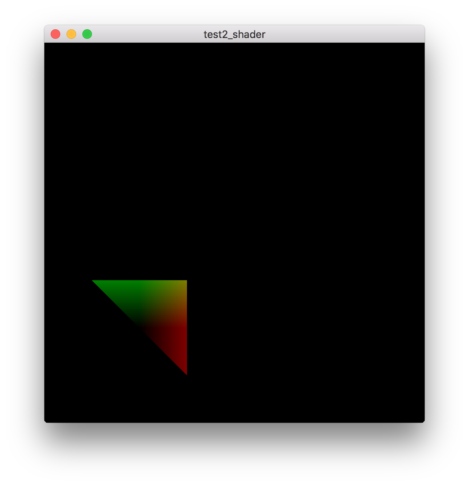

# 着色器

- 英文原版：http://learnopengl.com/#!Getting-started/Shaders

- 中文版：https://learnopengl-cn.github.io/01%20Getting%20started/05%20Shaders/

# 效果

# 关键字

- [GLSL（OpenGL Shading Language）](https://zh.wikipedia.org/wiki/GLSL)

- 数据类型：

    |类型|含义|
    |:---|:---|
    |int|整形|
    |float|浮点型|
    |double|双精度浮点型|
    |uint|无符号整形|
    |bool|布尔值|
    |vec`n`|包含n个float分量的默认向量|
    |bvec`n`|包含n个bool分量的向量|
    |ivec`n`|包含n个int分量的向量|
    |ivec`n`|包含n个int分量的向量|
    |dvec`n`|包含n个double分量的向量|
    |mat`n`|n维矩阵|

- Uniform：Uniform 是一种从 CPU 中的应用向 GPU 中的着色器发送数据的方式

- 顶点属性：通过在 shader 中添加形如 `layout(location = 0) in vec4 position;` 代码来进行数据传递

- 使用`in`、`out`关键字在不同 shader 中进行数据传递
